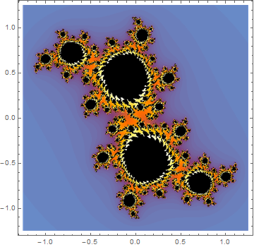

Tiny Code 1-Chunqing Tribe
====
小代码 1-纯情部落
====
http://2293.tk/tinycode
https://github.com/2293/tinycode

[toc]

HTML&Javascript&CSS
----

### ES6 & Javascript in Harmony
```
//const
 const PI = 3.14159265359;
 let circumference = 2 * PI * r;
 
 //Arrow functions
 var sq = x => x * x
 var getName = () => "Pablo";
 
 //Destructured assignment
 var [d, m, y] = [13, 2, 1963];
 
  // useful for swapping
    [x, y] = [y, x]
    
     // or multiple return values
    function now(){ return [13, 2, 2013, 8, 0]; }
    var [d, m] = now(); // d = 13, m = 2
    var [,,y] = now(); // y = 2013
    
   // Destructuring also works with objects.
    function today() { return { d:13, m:2, y:1963 }; }
    var { m:month, y:year } = today(); 
// month = 2, year = 1963

//Default Parameters
function myFunc( url, timeout=3000, callback=function(){} )

//Rest Parameters
function sum(first, second, ...others){
      console.log(others.length);
}

//Spread Operator
//Spread is the opposite of Rest parameters and splits an array into individual parameters.
    var a = [1,2,3,4,5]
    max = Math.max(...a) 
// equivalent to Math.max.apply(null,a) 
// or Math.max(1,2,3,4,5)

//Destructured Parameters
//Similar to a destructured assignment.
function setCookie( name, val, { secure, path, domain, expires })

//Iterators and Generators
//ES6 collection objects (like arrays, maps and sets) all have three default iterators. These are entries(), values() and keys() and cover most common iteration needs.
var a=['one','two','three']
    for(let e of a.entries()) console.log(e)
    
//array comprehensions.
    [ x for (x of a) if (x>5) ]
 
 /* A generator is a special kind of function that returns an iterator by inserting a * after the function keyword. A new yield keyword is used inside of generators to specify values that iterator should return when next() is called.*/
 
 function* gen(){
      yield 1;
      yield 2;
      yield 3;
    }
    let it = gen();
    for(let i of it) console.log(i); 
// outputs 1 2 3

//Collections: Set Map
let s = new Set([1,2,3]);
    s.has(4);     // false
    s.add(4);     // [1,2,3,4]
    s.add(2);     // still [1,2,3,4]
    s.delete(3);  // [1,2,4]
    
let m = new Map();
    o = {x:'blah'};
    m.set(o,'something to store');
    m.has(o); // true
    console.log(m.get(o));
    
//Maps can also be used with iterators.
    for (let [k, v] of m) console.log(k, v);
    
/*Symbols
Symbols generate unique inaccessible keys, useful in maps and class private members.
*/
let a = Map();
    {
      let k = Symbol();
      a.set(k, 'value');
// Here, we can get and reset 'value' as a.get(k).
    }
// Here, a.get(k) is invalid, a.size is 1, 
// but the key cannot be seen.

//WeakMap WeakSet

//Template Strings
   var name = 'Paul', age = 99;
   var s = `$(name), is apparently
     $(age) years old`;

/*Promises
Promises are a mechanism for handling results (and errors) from asynchronous operations. You can achieve the same thing with callbacks, but promises provide improved readability via method chaining and simple error handling. Promises are already used in many JavaScript libraries.*/

    getJSON("/api/product/1").then( function(p) {
      return getJSON(p.description);
    }).catch(function(err) {
      console.log('Oops..',err)
    });   
    
```

神奇命令行&冷酷网址
----

### SSH设置本地Socks5代理访问国外网站
```
ssh -D 2293 -i "tokyo.pem" ec2-user@54.249.37.217
set http_proxy=socks5://127.0.0.1:2293
set https_proxy=socks5://127.0.0.1:2293
```
### 命令行里进行宽带连接
```
%windir%\system32\rasphone.exe -d 宽带连接
```

### wget用例
```
#镜像站点
wget -m --random-wait --limit-rate=300k http://www.a-boy.tk

# 下载音乐文件
wget -r -l5 -H -t1 -nd -N -np -A=.ogg,.mp3,.midi -erobots=off -i music_sites_list.txt
#content of music_sites_list.txt like:
 #http://del.icio.us/tag/system:filetype:ogg
http://a-boy.tk/volcano/
http://sprott.physics.wisc.edu/midi/

# 下载网站图片 http://superuser.com/questions/434295/how-to-download-all-images-from-a-website-not-webpage-using-the-terminal
wget -r -l4 -H -t1 -nd -N -np -A=.jpg,.png,.gif -erobots=off  http://www.chromeexperiments.com/

# 下载最新 Chromium continuous chrome-win32.zip
wget http://commondatastorage.googleapis.com/chromium-browser-continuous/Win/`wget -q http://commondatastorage.googleapis.com/chromium-browser-continuous/Win/LAST_CHANGE -O-`/chrome-win32.zip

### 命令行直接下载JDK
wget --no-check-certificate -c --header "Cookie: oraclelicense=accept-securebackup-cookie" http://download.oracle.com/otn-pub/java/jdk/8u66-b18/jdk-8u66-windows-x64.exe
```

### Chat for GitHub
https://gitter.im/2293/ppmm

### make-a-resizable-chess-board
http://mathematica.stackexchange.com/questions/47441/how-to-make-a-resizable-chess-board

### apk downloader
http://apkleecher.com/download/?dl=com.smule.magicpiano
http://apkpure.com

###  lookup IP address and a domain name
```
$ host google.com
google.com has address 216.58.220.206
google.com has IPv6 address 2404:6800:4004:80d::1006
google.com mail is handled by 40 alt3.aspmx.l.google.com.

$ dig +noall +answer www.gnu.org
www.gnu.org.            300     IN      CNAME   wildebeest.gnu.org.
wildebeest.gnu.org.     300     IN      A       208.118.235.148
```

### assoc 和 ftype 两个命令修改windows文件默认打开方式
```
 设置打开.exe文件的方式为notepad，这是一个黑客测试
C:\> ftype exefile=notepad.exe %1 %

C:\> ftype exefile=hack.exe %* && "%1" %*
 改回默认状态，直接执行exe文件
C:\> ftype exefile="%1" %*

自定义新的.mus文件，用musicEditor.exe打开
C:\> assoc .mus=musicSheetFile
C:\> ftype musicSheetFile=musicEditor.exe "%1" %*
```

### git使用精要

保存git密码，不用每次输入git账号密码
```
$ git config credential.helper store #保存git密码
$ git config --global credential.helper 'cache --timeout 7200'  #缓存密码2小时
```
switch and delete branch by using
```
$ git checkout gh-pages
Switched to branch 'gh-pages'
$ git branch --delete master # delete a branch in local
$ git push origin --delete master   # delete a remote branch master, which is easier to remember than git push origin :<branchName>

```

### 百度搜索建议，联想词库json调用 
 http://suggestion.baidu.com/su?json=1&cb=queryList&wd=美女

### 自动跳转到某个Google镜像网址
http://uuxia.net/g

Mathematica Code
----

### Framed, Style an object
```
Table[If[PrimeQ[n], Style[n, Green], n], {n, 100}]
{Panel[1/x + y], Framed[1/x + y]}
```

### ArrayPlot
```
 ArrayPlot[RandomChoice[{Red, Green, Blue}, {19, 19}], Mesh -> True]
 
 ArrayPlot[{{-1, 0, 1}, {2, 3, -5}, {1, 2, 1}}, 
 ColorRules -> {_?EvenQ -> Red, 1 | -1 -> Blue, 
   x_ /; x < -1 -> Black}]
``` 

### GraphPlot
```
GraphPlot[RandomChoice[{0.01, 0.99} -> {1, 0}, {100, 100}]]

ArrayPlot[Table[Sin[x y], {x, -40, 40}, {y, -40, 40}], 
 ColorFunction -> "BlueGreenYellow"]
```
### JuliaSetPlot
JuliaSetPlot[.133 + .591 I]




科研进展&学术动态
----

### 2^74207281-1 is Prime | Hacker News
On January 7th at 22:30 UTC 2016, the Great Internet Mersenne Prime Search (GIMPS) celebrated its 20th anniversary with the math discovery of the new largest known prime number, 2^74,207,281-1, having 22,338,618 digits, on a university computer volunteered by Curtis Cooper for the project.

优秀软件
----

+ 数学三剑: Mathematica Sagemath Geogebra
+ HexChat - an IRC client based on XChat, open source, GUI
+ CCleaner - PC Optimization and Cleaning
+ Paint.NET - is free image and photo editing software for computers that run Windows.
+ ShareX - is a free and open source program that lets you capture or record any area of your screen and share it with a single press of a key. It also allows uploading images, text or other types of files to over 50 supported destinations you can choose from.  https://github.com/ShareX/ShareX
+ VLC media player

诗歌名句
----

	春天，十个海子全部复活
	在光明的景色中
	嘲笑这一个野蛮而悲伤的海子
	你这么长久的沉睡究竟为了什么
			----海子
	
	我细数它们坠落谷底，寂然化为流萤
	轻轻飘过我们星光花影的足踝
			----杨牧
	
	这是逝者之歌，浮沉在
	简单动人的传说里
	作为谣言的伴奏——
	有一支号角 城堡里吹
	展翅的神是浪迹的神
			----杨牧

	
	我手扶着庄稼的手呵 
	也抚摸着晴空的门 
	我斜靠着大海的身体 
	也斜靠着平原上河流滚滚的乡村 
	你的头颅正在高地奥蓝地转侧 
	你的中国人正在葵花上手编着芦苇成婚
			----骆一禾

						
	- 往事啊，你背叛了结局
	- 死亡是似曾相识的艺术
	- 翻掌之间，永恒与往事互换
			----诗阳

		风，把一只又一只鸟儿
		掷向天空的尽头
				----吉首大学 胡建文

### 指尖的森林掌心的海
	----原筱菲
	
	不要说遥远
	其实我已在你的掌心里
	并且日渐透明
	宁静无比 
	
	我的水滴
	是翩飞的水鸟
	绕过你手指的森林
	栖落在你的指尖
	你也把蓊郁的绿色
	投影在我的水面
	让我的心海不再空旷
	
	握紧我吗
	覆盖我吗
	让我梦的水滴渗入你的根须吗
	 
	不要张开
	不要让清澈的水
	苦涩着从你的指缝滴尽
	叶子不要为季节飘落
	不要让虔诚的鸟儿追逐得
	太久  太远 
	
	其实有时我不想飞
	我想穿行在你影子里的
	做一只悠闲的小鱼
	
	
### 黑夜的翅膀 
	----星球《星球暮歌》
		
	黑夜的翅膀曾经触摸， 
	人类最初山岩上牧羊人竹青色的笛子， 
	和羊子般在夜晚甜蜜吟唱的金色嗓音， 
	然后在大理石神殿的山墙上， 
	被悲剧性的梦幻缠绕， 
	在伦敦和巴黎命运般的海峡两端， 
	被之后多少个世代因遥远而起的重量压弯。
	
	于是我火山般沉醉毁灭之美的爱情， 
	从第一天起便是一座荒废掉的码头， 
	没有一根手指之河的流淌触摸使它平静， 
	没有一只带着信风的轻舟驻留使它生辉。
	
	黑夜的翅膀，风中痛苦扇动， 
	我们一页页翻过人类的日子， 
	在一束芦花丛中， 
	遥望江上明月， 
	怀想遥远阁楼上的美丽女人。 
	只有她们， 
	犹如我们曾经自由飞翔的古老岁月中， 
	一双幽幽的眼睛， 
	与我们寂寞相依。
	
	
	--
